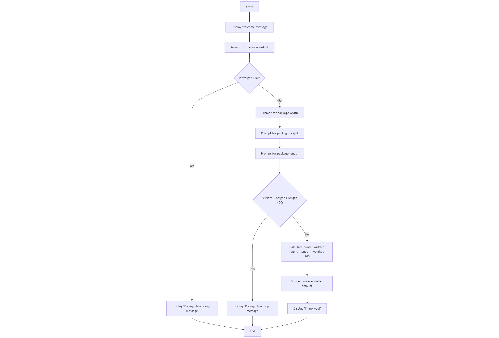

# Shipping Calculator

A console application for calculating shipping quotes based on package dimensions and weight.

## Overview

This C# console application helps users calculate shipping costs for packages based on their dimensions (width, height, length) and weight. The application implements various validation rules to ensure packages meet shipping requirements.

## Features

- Weight validation (packages over 50 units are rejected)
- Dimension validation (total dimensions over 50 units are rejected)
- User-friendly console interface
- Input validation for all measurements
- Automatic quote calculation

## Requirements

Full requirements can be found in the [Requirements](./Requierments.md) document.

## Logic Flow

The application logic flow is documented in the [logic diagram](./logic.mmd):



## Setup

1. Requirements:
   - .NET 9.0 or later
   - Visual Studio 2022 or VS Code with C# extension

2. Clone the repository:
   ```powershell
   git clone https://github.com/marry2-eng/Shipping_Calculator.git
   cd Shipping_Calculator
   ```

## Running the Application

1. Using .NET CLI:
   ```powershell
   dotnet build
   dotnet run
   ```

2. Using Visual Studio:
   - Open `Shipping_Calculator.sln`
   - Press F5 or click "Start Debugging"

## How to Use

1. When prompted, enter the package weight
2. If weight is acceptable, enter the package dimensions:
   - Width
   - Height
   - Length
3. The application will either:
   - Show an error if the package is too heavy or too large
   - Display the calculated shipping quote

## Example Output

```
Welcome to Package Express. Please follow the instructions below.

Please enter the package weight:
40

Please enter the package width:
10

Please enter the package height:
12

Please enter the package length:
11

Your estimated total for shipping this package is: $528.00

Thank you!
```
